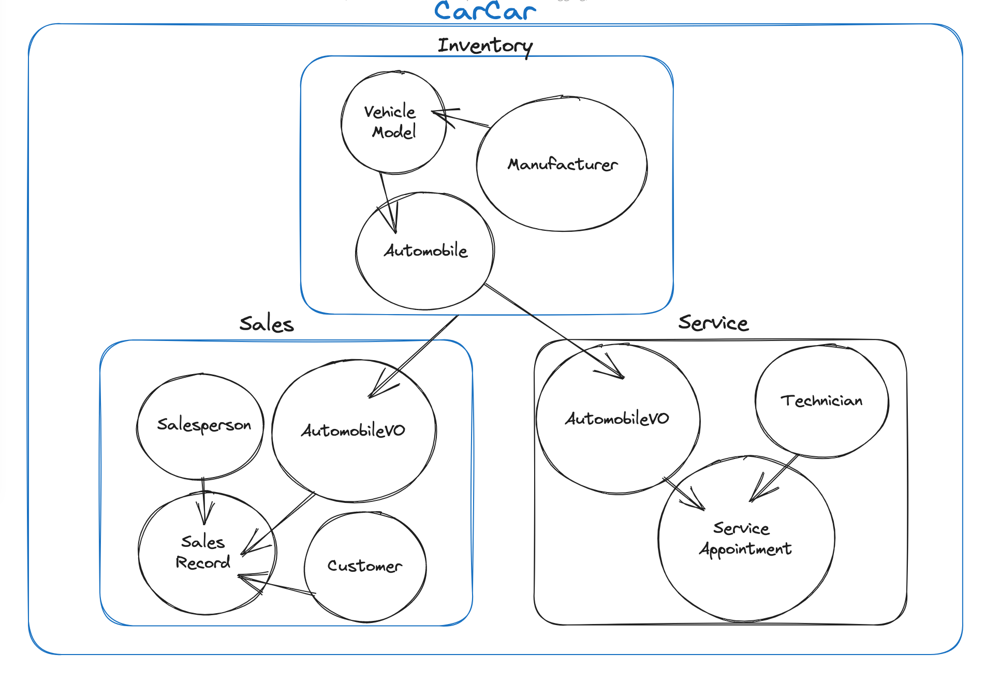

### CarCar

Team:

* Rosanna Wyatt - Auto Services
* Amanda Gifford - Auto Sales

## Getting Started

**Make sure you have Docker, Git and Node.js 18.2 or above**

1. First, please fork this repository.

2. Second, please clone the forked repository onto your local computer: git clone <<repository.url.here>>

3. Third, please build and run the project using Docker with the following commands:

```
    docker volume create beta-data
    docker-compose build
    docker-compose up
```

* After running these commands, make sure all of the Docker containers are running

* View the project in the browser at http://localhost:3000/

## Design

CarCar is made up of 3 microservices which are dependent on one and other:



**Integration - How our microservices work together to maintain the application**

Our Sales and Service domains work together with our Inventory domain to make everything in the CarCar application work seamlessly.

In our application, the inventory domain acts as the root domain for keeping track of the automobiles that are on our lot and are available to purchase. Our sales and service microservices obtain information from the inventory domain through **polling**, which is a process within which the inventory domain will send data about the automobile inventory to each of the sales and services microservices. Both of these microservices are then able to regularly update their own internal database with the latest data from the inventory application.

# Inventory

## Manufacturers:

From Insomnia and your browser, you can access the manufacturer endpoints at the following URLs.

| Action | Method | URL
| ----------- | ----------- | ----------- |
| List manufacturers | GET | http://localhost:8100/api/manufacturers/
| Create a manufacturer | POST | http://localhost:8100/api/manufacturers/ 
| Get a specific manufacturer | GET | http://localhost:8100/api/manufacturers/id/
| Update a specific manufacturer | PUT | http://localhost:8100/api/manufacturers/id/
| Delete a specific manufacturer | DELETE | http://localhost:8100/api/manufacturers/id/

Creating and updating a manufacturer requires only the manufacturer's name.

```
{
  "name": "Chrysler"
}
```

The return value of creating, getting, and updating a single manufacturer is its name, href, and id.

```
{
  "href": "/api/manufacturers/1/",
  "id": 1,
  "name": "Chrysler"
}
```

The list of manufacturers is a dictionary with the key "manufacturers" set to a list of manufacturers.

```
{
  "manufacturers": [
    {
      "href": "/api/manufacturers/1/",
      "id": 1,
      "name": "Daimler-Chrysler"
    }
  ]
}
```

## Vehicle Models:

From Insomnia and your browser, you can access the manufacturer endpoints at the following URLs.

| Action | Method | URL
| ----------- | ----------- | ----------- |
| List vehicle models | GET | http://localhost:8100/api/models/
| Create a vehicle model | POST | http://localhost:8100/api/models/
| Get a specific vehicle model | GET | http://localhost:8100/api/models/id/
| Update a specific vehicle model | PUT | http://localhost:8100/api/models/id/
| Delete a specific vehicle model | DELETE | http://localhost:8100/api/models/id/

Creating a vehicle model requires the model name, a URL of an image, and the id of the manufacturer.

```
{
  "name": "Rav4",
  "picture_url": "https://upload.wikimedia.org/wikipedia/commons/thumb/7/71/Chrysler_Sebring_front_20090302.jpg/320px-Chrysler_Sebring_front_20090302.jpg",
  "manufacturer_id": 1
}
```

Updating a vehicle model can take the name and/or the picture URL. It is not possible to update a vehicle model's manufacturer.

```
{
  "name": "S8",
  "picture_url": "https://upload.wikimedia.org/wikipedia/commons/thumb/7/71/Chrysler_Sebring_front_20090302.jpg/320px-Chrysler_Sebring_front_20090302.jpg"
}
```

Getting the detail of a vehicle model, or the return value from creating or updating a vehicle model, returns the model's information and the manufacturer's information.

```
{
  "href": "/api/models/1/",
  "id": 1,
  "name": "Highlander",
  "picture_url": "https://upload.wikimedia.org/wikipedia/commons/thumb/7/71/Chrysler_Sebring_front_20090302.jpg/320px-Chrysler_Sebring_front_20090302.jpg",
  "manufacturer": {
    "href": "/api/manufacturers/1/",
    "id": 1,
    "name": "Toyota"
  }
}
```

Getting a list of vehicle models returns a list of the detail information with the key "models".

```
{
  "models": [
    {
      "href": "/api/models/1/",
      "id": 1,
      "name": "Highlander",
      "picture_url": "https://upload.wikimedia.org/wikipedia/commons/thumb/7/71/Chrysler_Sebring_front_20090302.jpg/320px-Chrysler_Sebring_front_20090302.jpg",
      "manufacturer": {
        "href": "/api/manufacturers/1/",
        "id": 1,
        "name": "Toyota"
      }
    }
  ]
}
```

## Automobiles

From Insomnia and your browser, you can access the automobile endpoints at the following URLs.

**Note:** The identifiers for automobiles in this API are not integer ids. They are the Vehicle Identification Number (VIN) for the specific automobile.

| Action | Method | URL
| ----------- | ----------- | ----------- |
| List automobiles | GET | http://localhost:8100/api/automobiles/
| Create an automobile | POST | http://localhost:8100/api/automobiles/
| Get a specific automobile | GET | http://localhost:8100/api/automobiles/vin/
| Update a specific automobile | PUT | http://localhost:8100/api/automobiles/vin/
| Delete a specific automobile | DELETE | http://localhost:8100/api/automobiles/vin/


You can create an automobile with its color, year, VIN, and the id of the vehicle model.

```
{
  "color": "red",
  "year": 2012,
  "vin": "1C3CC5FB2AN120174",
  "model_id": 1
}
```
*Note:* Please make sure VIN is no longer than 17 charachters, the standard length of a VIN 
As noted, you query an automobile by its VIN. For example, you would use the URL

http://localhost:8100/api/automobiles/1C3CC5FB2AN120174/

to get the details for the car with the VIN "1C3CC5FB2AN120174". The details for an automobile include its model and manufacturer.

```
{
  "href": "/api/automobiles/1C3CC5FB2AN120174/",
  "id": 1,
  "color": "yellow",
  "year": 2013,
  "vin": "1C3CC5FB2AN120174",
  "model": {
    "href": "/api/models/1/",
    "id": 1,
    "name": "Highlander",
    "picture_url": "https://upload.wikimedia.org/wikipedia/commons/thumb/7/71/Chrysler_Sebring_front_20090302.jpg/320px-Chrysler_Sebring_front_20090302.jpg",
    "manufacturer": {
      "href": "/api/manufacturers/1/",
      "id": 1,
      "name": "Toyota"
    }
  },
  "sold": false
}
```

You can update the color, year, and sold status of an automobile.

```
{
  "color": "red",
  "year": 2012,
  "sold": true
}
```

Getting a list of automobiles returns a dictionary with the key "autos" set to a list of automobile information.

```
{
  "autos": [
    {
      "href": "/api/automobiles/1C3CC5FB2AN120174/",
      "id": 1,
      "color": "yellow",
      "year": 2013,
      "vin": "1C3CC5FB2AN120174",
      "model": {
        "href": "/api/models/1/",
        "id": 1,
        "name": "Highlander",
        "picture_url": "https://upload.wikimedia.org/wikipedia/commons/thumb/7/71/Chrysler_Sebring_front_20090302.jpg/320px-Chrysler_Sebring_front_20090302.jpg",
        "manufacturer": {
          "href": "/api/manufacturers/1/",
          "id": 1,
          "name": "Toyota"
        }
      },
      "sold": false
    }
  ]
}
```


## Sales

In the sales microservice, there are four models: AutomobileVO, Customer, Salesperson, and Sale. The first three mentioned all send data to the view that creates a new sale in order to create a new Sale object.

The AutomobileVO is a value object and is constantly being updated by the poller which is polling the inventory api database and therefor has up-to-date data on the automobiles objects in the inventory api, down to the second.

## Accessing Endpoints to Send and View Data through Insomnia:

### Customers:

| Action | Method | URL
| ----------- | ----------- | ----------- |
| List customers | GET | http://localhost:8090/api/customers/
| Create a customer | POST | http://localhost:8090/api/customers/
| Delete a customer | DELETE | http://localhost:8090/api/customers/id/delete/

To create a Customer, send this JSON Body:

```
{
	"name": "Jamie Foxx",
	"address": "1585 Strawsbury Way",
	"phone_number": 2158907654
}
```

Return value of a created customer:

```
{
	"id: 11,
	"name": "Britney Spears",
	"address": "1314 Maple Ave",
	"phone_number": 9201987648
}
```

Return value of customer list:

```
{
	"customers": [
		{
			"id": 1111,
			"name": "Robert Andre",
			"address": "1585 Suez Street",
			"phone_number": "3124536789"
		},
		{
			"id": 888,
			"name": "Bob Barker",
			"address": "1333 Banbury Way",
			"phone_number": "6782345746"
		}
	]
}
```

### Salespeople:

| Action | Method | URL
| ----------- | ----------- | ----------- |
| List salespeople | GET | http://localhost:8090/api/salespeople/
| Create a salesperson | POST | http://localhost:8090/api/salespeople/
| Delete a salesperson | DELETE | http://localhost:8090/api/salesperson/id/delete/
​
To create a salesperson, send this JSON body:

```
{
	"name": "Sparky Robbins",
	"employee_id": "11"
}
```

Return value of creating a salesperson:

```
{
	"id": 1,
	"name": "Tony",
	"employee_number": 1
}
```

List all salespeople return value:

```
{
	"salespeople": [
		{
			"id": 1,
			"name": "Oliver Twist",
			"employee_number": 1
		}
	]
}
```

### Record of Sales:

| Action | Method | URL
| ----------- | ----------- | ----------- |
| List all salesrecords | GET | http://localhost:8090/api/sales/
| Create a new sale | POST | http://localhost:8090/api/sales/
| Delete a sale | DELETE | http://localhost:8090/api/sale/id/delete/

List all sales return value:

```
{
	"sales": [
		{
		 "automobile": {
			  "vin": :"Ed23456Y",
        "import_id": 3,
				"sold": false
			},
			"salesperson": {
				"id": 11,
				"name": "Robert",
				"employee_number": 5
			},
			"customer": {
				"name": "Amanda Gifford",
				"address": "2987 Rolly Way",
				"phone_number": "4523478711"
			},
         "id": 11
		}
	]
}
```

Create a new sale:

```
  {
	"price": 88888,
	"automobile": {
		"id": 11
	},
	"salesperson": {
		"id": 11
	},
	"customer": {
     "id": 13
	}
}
```

Return value of creating a new sale:

```
{
	"price": 888888,
	"vin": {
		"vin": "239085647"
	},
	"salesperson": {
		"id": 11,
		"name": "Dalton",
		"employee_number": 11
	},
	"customer": {
		"id",
		"name": "Sam Rollings",
		"address": "2987 Luis St",
		"phone_number": "4156785678"
  },
    "id": 111
  }
  ```

### AutomobileVO

This is a value object based on the automobiles in the inventory microservice. They are created via a poller which polls the inventory microservice database every second, checks for changes to the automobile objects, and updates the sales microservice database accordingly.

## Service microservice

The service microservice handles the side of the dealership relating to vehicle maintenance and repair. There are three models in this microservice. They are: AutomobileVO, Technician, and Appointment.

### Technicians

*endpoints*

| Action | Method | URL
| ----------- | ----------- | ----------- |
| List technicians | GET | http://localhost:8080/api/technicians/
| Create a technician | POST | http://localhost:8080/api/technicians/
| Delete a technician | DELETE | http://localhost:8080/api/technicians/id/

*List technicians:* This endpoint returns a list of all currently employed technicians. The method mut be "get" and no data needs to be provided. See example below of output:

```

{
	"technicians": [
		{
			"id": 1,
			"first_name": "Bob",
      "last_name": "Belcher",
			"employee_id": 100
		},
  ]
}
```

*Create a technician:* Use this endpoint to create a new technician. The request method must be "post" and data must be provided as follows:

```
{
	"first_name": "Tina",
  "last_name": "Belcher",
	"employee_id": 102
}
```

Once the request is submitted, upon succesful creation the details of the new technician will be returned in the following format:

```
{
	"id": 5,
	"first_name": "Tina",
	"last_name": "Belcher",
	"employee_id": 102
}
```
Note: every technician has an id, which is unique and automatically generated by the system when the technician instance is created, and an employee id, which is chosen by the used and manually assigned during the creation process.

*Delete a technician:* Use this endpoint to delete a specific technician. The id represents the technician's unique id (NOT the manually-assigned employee ID). id should therefore be replaced with the id of the technician to be deleted. For example: http://localhost:8080/api/technicians/2/ . To use this enpoint the request method must be "delete" and no data needs to be provided. Upon successful deletion, the following response will be returned:

```
{
	"message": "technician 102 deleted"
}
```
Note: the number in this message is the employee id number that was manually assigned to that technician upon creation.

### Appointments

*endpoints*

| Action | Method | URL
| ----------- | ----------- | ----------- |
| List appointments | GET | http://localhost:8080/api/appointments/
| Create appointment | POST | http://localhost:8080/api/appointments/
| Cancel appointment | PUT | http://localhost:8080/api/appointments/id/cancel/
| Finish appointment | PUT | http://localhost:8080/api/appointments/id/finish/

*List appointments:* This endpoint returns a list of all currently and previously scheduled appointments, including those that have a status of canceled. The request method must be "get" and no data needs to be provided. See example below of output:

```
		{
			"id": 7,
			"date_time": "2023-06-22T12:00:00+00:00",
			"reason": "Brakes",
			"status": "scheduled",
			"vin": "1C3CC5FB2AN120174",
			"customer": "Teddy McGillicuddy",
			"technician": {
				"id": 7,
				"first_name": "Linda",
				"last_name": "Belcher",
				"employee_id": 103
			}
    }
```

*Create an appointment:* Use this endpoint to create a new appointment. The request method must be "post" and data must be provided as follows:

```
{
	"date_time" : "2023-11-13T08:14:00",
	"reason" : "Hi Bobby",
	"vin": "1C3CC5FB2AN120174",
	"customer" : "Linda Belcher",
	"technician" : 1
}
```
*IMPORTANT:* Please make sure that the VIN has no more than 17 characters, as this is the standard length of a VIN. The system will accept VINs with fewer than 17 characters, but not more.

Note: the id that is submitted in the technician field must correspond to an active technician in the system, otherwise an error will be thrown.

Once the request is submitted, upon succesful creation the details of the new appointment will be returned in the following format:

```
{
	"id": 6,
	"date_time": "2023-11-13T08:14:00",
	"reason": "Hi Bobby",
	"status": "scheduled",
	"vin": "1C3CC5FB2AN120174",
	"customer": "Linda Belcher",
	"technician": {
		"id": 1,
		"first_name": "Bob",
		"last_name": "Belcher",
		"employee_id": 100
	}
}
```

*Cancel an appointment:* Use this endpoint to cancel an existing appointment. The id represents the appointment's unique id. id should therefore be replaced with the id of the appointment to be canceled. For example: http://localhost:8080/api/appointments/5/cancel The request method must be "put" and no data needs to be provided. Once the request is submitted, if the appointment exists in the database the status property of the referenced apponitment instance is changed to "canceled" and the following message is returned:

```
{
	"message": "status updated to canceled"
}
```

*Finish an appointment:* Use this endpoint to update an existing appointment's status once it is completed. The id represents the appointment's unique id. id should therefore be replaced with the id of the appointment to be updated. For example: http://localhost:8080/api/appointments/5/finish The request method must be "put" and no data needs to be provided. Once the request is submitted, if the appointment exists in the database the status property of the referenced apponitment instance is changed to "finished" and the following message is returned:

```
{
	"message": "status updated to finished"
}
```

### AutomobileVO

This is a value object based on the automobiles in the inventory microservice. They are created via a poller which polls the inventory microservice database every 60 seconds, checks for changes to the automobile objects, and updates the service microservice database accordingly.
